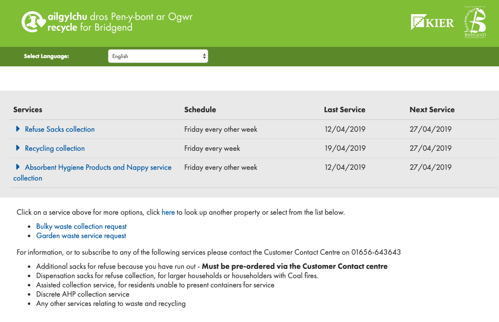

# Google Home - Custom actions

Aim: To play around with Google Cloud Functions, [Google Dialogflow](https://dialogflow.com/), and Google Home

## Why
A few weeks ago I won a Google home mini from one of the prize draws which users of Google Pay are entered into. This was a shock as I NEVER win this kind of thing. Anyway, I enjoyed using it for the usual tasks - casting youtube videos to my TV, playing songs from Spotify etc. Naturally I wanted to write some custom functionality because why not!?

## How
In the area I live, standard refuse is collected fortnightly, and recycling is collected weekly. Every week I draw a blank and forget which collection week it is. This is further complicated when bank holidays occur, and the schedule is altered to accommodate them. This gave me an idea - why not write a command for Google  to retrieve this information for me on demand. My local council makes this information available via its website, in the following format:

How hard can it be to create an action which crawls this site, picks out the appropriate information and feeds this back to the user? Turns out not very :)

In order to create the command I followed the [fairly straightforward instructions provided by Google](https://developers.google.com/actions/). In order to fulfil this request, I was required to provide an endpoint which Google would forward the appropriate data to, and respond to the user dynamically depending on the response of that endpoint. Rather than self-host an API it made perfect sense to write a Google Cloud function for this - [code available here](./refuse/)

## The result
        
[This video](./img/refuse-compressed.mp4) shows it in action
